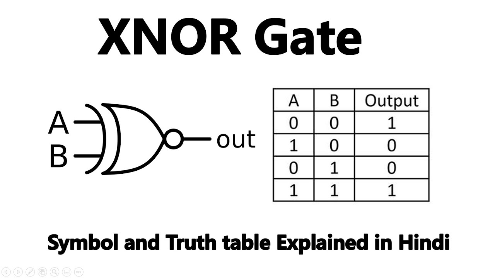
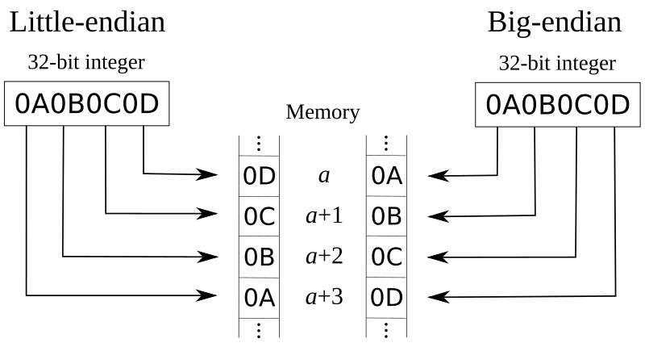

# Bit manipulation

## Basics
### Hexadecimal Conversion (十六進位)
Hexadecimal numbers uses 16 values to represent a number. (4個一數) Numbers from 0-9 are expressed by digits 0-9 and 10-15 are represented by characters from A – F.

Example: 
0101 = 5
1010 = A
1010 1010 1010 1010 1010 1010 1010 1010 = 0x
### Signed & Unsigned Representation
Signed: Allows both negative and positive numbers. The first bit represents the sign (0 for non-negative, 1 for negative), and the remaining bits represent the magnitude of the number. Two's complement is commonly used.

Unsigned: Only allows non-negative numbers. The entire bit range represents the magnitude of the number.

#### Range
Signed: $-2^{(n-1)} \text{ to } 2^{(n-1)} - 1 = 10000000 \text{ to } 0111111111$
Unsigned: $0 \text{ to } 2^n - 1$

### Overflow 
If a number exceeds the upper bound of its representation, it overflows. In signed representation, the next number after the maximum positive value is the minimum negative value, while in unsigned representation, it wraps around to 0.

### Operations
| Operators | Operations | Result |
|-----------|------------|--------|
| XOR       | X ^ 0s     | X      |
| XOR       | X ^ 1s     | ~X     |
| XOR       | X ^ X      | 0      |
| AND       | X & 0s     | 0      |
| AND       | X & 1s     | X      |
| AND       | X & X      | X      |
| OR        | X \| 0s    | X      |
| OR        | X \| 1s    | 1s     |
| OR        | X \| X     | X      |

### Magic Operations
```c
// XNOR = ~(a ^ b)

// 最后一位取反(101101->101100)                                
x ^ 1

// 取末k位(1101101->1101,k=5)
x & ((1 << k)-1)

// 末k位取反(101001->100110,k=4)                        
x ^ ((1 << k)-1)

// 把右边连续的1变成0(100101111->100100000)               
x & (x+1)

// 把右边连续的0变成1(11011000->11011111)
x | (x-1)

// 取右边连续的1(100101111->1111)                        
(x^(x+1)) >> 1

// 去掉右起第一个1的左边(100101000->1000,树状数组)
x & (x ^ (x-1))
```


### Basic bit operation functions
```c
// Get bit
boolean getBit(int i, int num){
     return ( (num & (1 << i)) != 0 ) 
}
// Set bit (set i to 1)
int setBit(int i, int num){
		return num | (1 << i);
}

// Update
int upateBit(int num, int i, Boolean bitIs1){
    int mast = ~(1 << i)
		return (num & mask) | (bitIs1 << i); 
}

// Clear bit
int clearBit(int num, int i) {
		int mast = ~(1 << i);
		return num & mask;
}
```

### Switch a and b
1. a -= b, b += a, a = b - a
2. a ^= b, b ^= a, a ^= b

### Big Little endian
Big-endian: The most-significant byte of a word is stored at lower memory addresses.
Little-endian: The most-significant byte of a word is stored at higher memory addresses.


Quiz: To check is big endian, assign with 00000001 00000010. If 
```cpp
bool IsBigEndian()
{
    union
    {
        unsigned short a ;
        char b ; // c.b represents the first byte of the memory location occupied by the union member c
    } c;


    c.a =0x0102 ;
    
	if(c.b == 1) // The first byte (c.b) is 00000001, which is 1
        return true ;
    else
        return false ;
}
```

## Practice & Leetcode
There is an unsigned integer n, and we want to swap the value in position 0 with 1, position 2 with 3, and so on and so forth. 

```cpp
a = (n>>1) & 0x55555555
b = (n<<1) & 0xAAAAAAAA
res = a & b
```
[Hamming Distance](https://leetcode.com/problems/bitwise-and-of-numbers-range/description/)<br>
[Total Hamming Distance](https://leetcode.com/problems/total-hamming-distance/description/)

## Resources
[Standford bit minipulation](https://www.notion.so/chentzj/Nvidia-Interview-Prepare-70951ba8d8c645de949d614f861be84c?pvs=4#1565d10885e945ceb4f9d322b6041c57)<br>
[Geeksforgeeks](https://www.geeksforgeeks.org/all-about-bit-manipulation/)