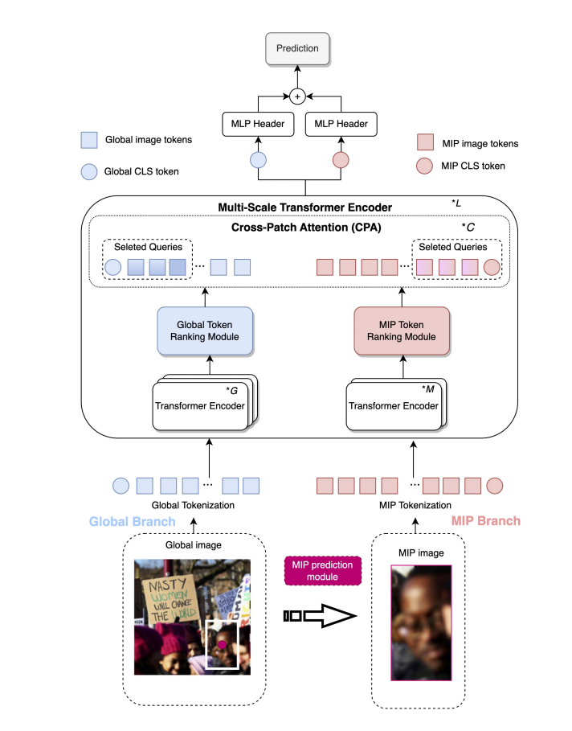
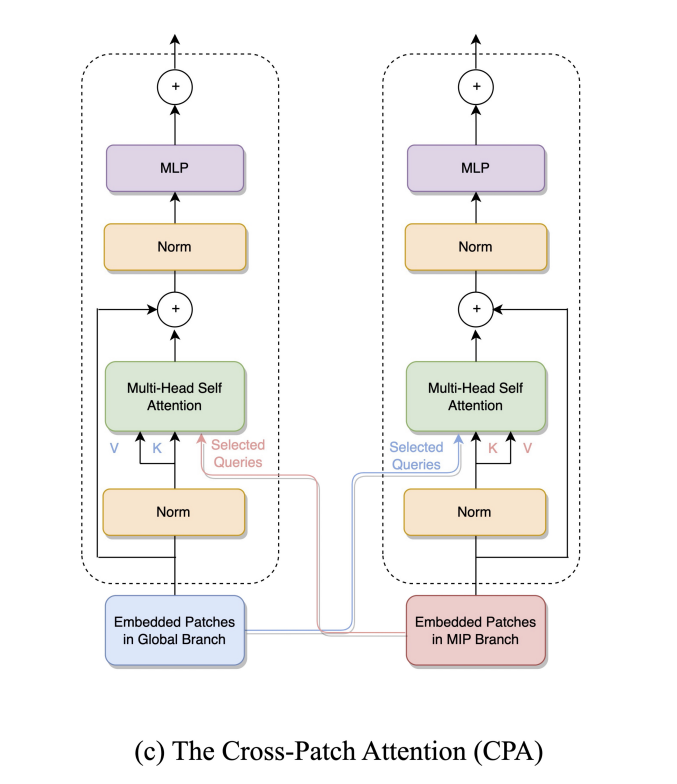

# Background

### Paper
#### Problem
* Most existing methods lack attention to affective meaning in group dynamics and fail to acount for the contextual relevance of faces and objects in group-level images.

#### Proposal
* First work introducing MIP into the group affect task and validate that MIP plays a crucial role in group affect recognition. 
* The MIP and global affective context information are integrated into the proposed dual-pathway vit architecture.

#### Method

##### Dual-pathway learning
* Both the global and MIP image are tokenized into patches
* Then class token and a learnable position embedding are added to both branches.
##### Transformer Encoder
- The global branch is the large (primary) branch with a coarse patch size, with a larger embedding size, and more transformer encoders.
- The MIP image is the input of a small (complementary) branch with fine-grained patch size (i.e., 16), fewer encoders, and a smaller embedding size.
##### Token Ranking Module
* To remove unimportant patches.
* Denote the token importance by the similarity scores between the global class token and each patch token.
##### CPA
Based on the importance score of each token, we then costruct a newly selected query matrix by selecting the top α query vectors.

## CT MRI Volume Rendering

[Getting Started with Volume Rendering using OpenGL - CodeProject](https://www.codeproject.com/Articles/352270/Getting-Started-with-Volume-Rendering-using-OpenGL)

1. Store multiple textures with different z axis.
2. Do transparency, set alpha to 0 for some points that have alpha smaller than the threshold
3. Do blending and disable depth test.

Rotation issue

- when the model is rotating by z axis, 上下顛倒
- when the model is rotating 90 or 270 degree, the image wil disappear since there are no enough textures