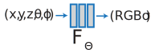

# Background

## MobileDrive
### Model optimization pipeline
1. Perform NAS and Pruning on YOLOv5’s backbone architecture
2. Map optimized backbone architecture back to YOLOv5
3. Apply KD and Quantization on the whole network

### NAS
Goal: Automatically search a network architecture that leads to the best performance

Architecture:
* Blocks: bottleneck block, inception block, residual block, etc.
* Layers: convs, pooling, fc, etc.
* Hyperparameters: number of filters, size of kernel, stride, padding, etc.

Search space: The set containing all the possible architectures

#### One Shot NAS
SuperNet: A huge network containing all search space candidates
Pros: Much faster

### Pruning
#### Channel Pruning
Goal: Aim to remove less important channels while minimizing the accuracy loss  
Ranking algorithm: To rank the importance of every channel 

### KD
Teacher (large, accurate model) 
Student (small, efficient model)
To Improve student’s accuracy (better than training from scratch)  

## Paper
### Problem
* Most existing methods lack attention to affective meaning in group dynamics and fail to acount for the contextual relevance of faces and objects in group-level images.

### Motivation
* Using all MIP produce worse results.
* Using MIP only is not enough (tell the story).
* Not all patches are needed. Complex background (crowded images) requires removing uninformation tokens.

### Proposal
* First work introducing MIP into the group affect task and validate that MIP plays a crucial role in group affect recognition. 
* The MIP and global affective context information are integrated into the proposed dual-pathway vit architecture.

### Method

#### Dual-pathway learning
* Both the global and MIP image are tokenized into patches
* Then class token and a learnable position embedding are added to both branches.
#### Transformer Encoder
- The global branch is the large (primary) branch with a coarse patch size, with a larger embedding size, and more transformer encoders.
- The MIP image is the input of a small (complementary) branch with fine-grained patch size (i.e., 16), fewer encoders, and a smaller embedding size.
#### Token Ranking Module
* To remove unimportant patches.
* Denote the token importance by the similarity scores between the global class token and each patch token.
#### CPA
Based on the importance score of each token, we then costruct a newly selected query matrix by selecting the top query vectors.

#### Class Token and Positional Encoding
[Intro to Class token and positional embedding](https://deepganteam.medium.com/vision-transformers-for-computer-vision-9f70418fe41a)
[Why use class token?](https://datascience.stackexchange.com/questions/90649/class-token-in-vit-and-bert)

[Presentation slide](https://docs.google.com/presentation/d/1_wSrmuKN2r8Ue_UypCsoKqRkfPLuOJQg/edit?usp=sharing&ouid=117334240525465093292&rtpof=true&sd=true)

## CT MRI Volume Rendering

[Getting Started with Volume Rendering using OpenGL - CodeProject](https://www.codeproject.com/Articles/352270/Getting-Started-with-Volume-Rendering-using-OpenGL)

1. Store multiple textures with different z axis.
2. Do transparency, set alpha to 0 for some points that have alpha smaller than the threshold
3. Do blending and disable depth test.

Rotation issue

- when the model is rotating by z axis, 上下顛倒
- when the model is rotating 90 or 270 degree, the image wil disappear since there are no enough textures

## Neural Radiance Field
### Method
* **To represents a scene using a fully-connected (non-convolutional) deep network.**
* Input is a single continuous 5D coordinate (spatial location (x, y, z) and camera viewing direction (θ, φ)) [theta_and_pi](https://www.cs.cmu.edu/~barbic/camera.html).
* Output is the volume density and view-dependent emitted radiance at that spatial location (r, g, b).
* Querying 5D coordinates along camera rays and use classic volume rendering techniques to project the output colors and densities into an image.
* Volume density is unrelated to view angles and only rely on coordinates. Therefore, do two passes in the neural network. The first pass recieve coordinates as input and output volume density and an intermediate value for rgb. Then, the second pass recieve the intermediate value and viewing direction to produce final rgb. 
{width="60%"}

### Ways to improve for synthesizing novel angles
* Add noise while training. (ex: Input coordinate perturbation, point sampling)
* Utilize image features (embedded by CNN networks).
* Model pretrained on similar categories.
