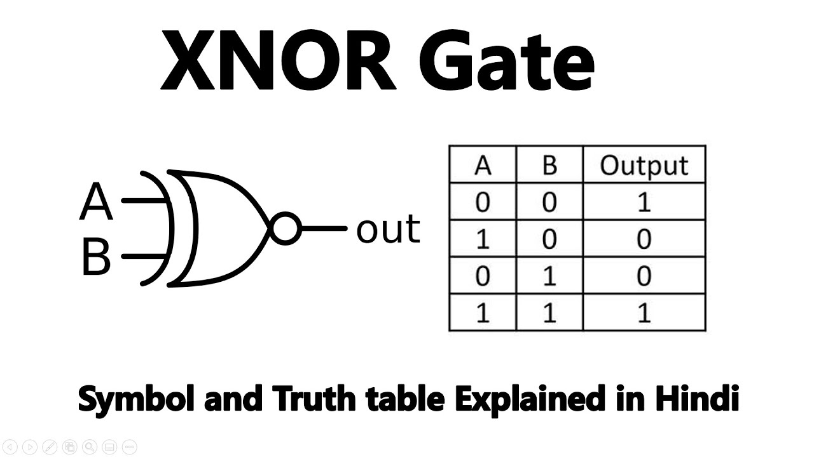
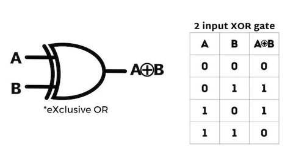

# Bit manipulation

```c
x ^ 0s = x    x & 0s = 0    x | 0s = x
x ^ 1s = ~x   x & 1s = x    x | 1s = 1s
x ^ x  = 0    x & x = x     x | x  = x

// XNOR = ~(a ^ b)

// 最后一位取反(101101->101100)                                
x ^ 1

// 取末k位(1101101->1101,k=5)
x & ((1 << k)-1)

// 末k位取反(101001->100110,k=4)                        
x ^ ((1 << k)-1)

// 把右边连续的1变成0(100101111->100100000)               
x & (x+1)

// 把右边连续的0变成1(11011000->11011111)
x | (x-1)

// 取右边连续的1(100101111->1111)                        
(x^(x+1)) >> 1

// 去掉右起第一个1的左边(100101000->1000,树状数组)
x & (x ^ (x-1))
```





```c
// Get bit
boolean getBit(int i, int num){
     return ( (num & (1 << i)) != 0 ) 
}
// Set bit (set i to 1)
int setBit(int i, int num){
		return num | (1 << i);
}

// Update
int upateBit(int num, int i, Boolean bitIs1)
    int mast = ~(1 << i)
		return (num & mask) | (bitIs1 << i); 
}

// Clear bit
int clearBit(int num, int i) {
		int mast = ~(1 << i);
		return num & mask;
}
```