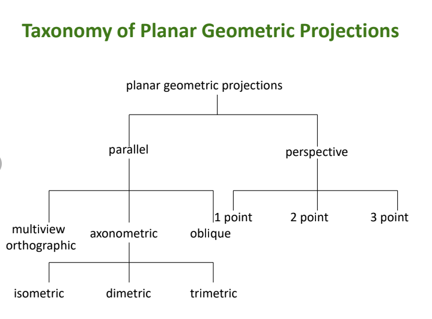
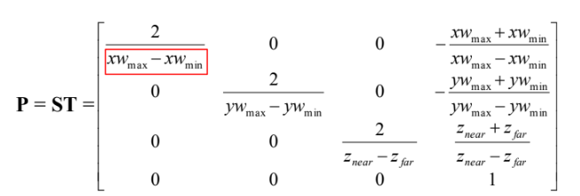
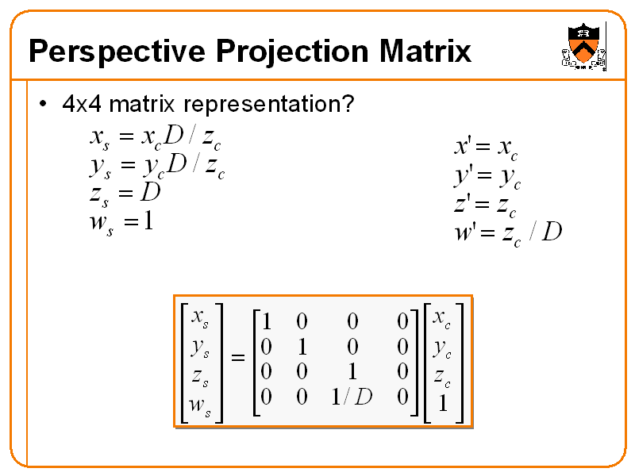

# MVP

## **Model Transformation (M)**

Involves altering the position of objects.

---

## **View transformation** (V)

Pertains to adjusting the position of the camera using operations like **`glLookAt(eyex, eyey, eyez, atx, aty, atz, upx, upy, upz)`**.

---

To execute these transformations: (Notability Chapter 2) 

1. Initially, reset the object (or camera) position to the origin.
2. Then, apply rotation and translation matrices to achieve the desired transformation.
3. Finally, return the object (or camera) to its original position.

For example: **`-T * R * T`**

It's crucial to note that the formula follows a right-to-left sequence, and certain operations, such as **`Rx * Ry`**, are non-commutative (**`Rx * Ry ≠ Ry * Rx`**).

Full rotation and translation: [3D geometric transformation - HackMD](https://hackmd.io/@Daichou/S1lEgQq6Z?type=view)

---

## **Projection transformation (P) + Normalization:**

Projection transformation: 按下快門

Normalization: 將物體縮放至可以project to projection plane

- Orthogonal
    - Normalization
        
        
        
- Perspective
    - Projection: only need to transform w to w’, since the last dimension value should be 1.
        
        
        
    - Normalization (same as orthogonal normalization)

---

## References

[MVP Transformation](https://zhuanlan.zhihu.com/p/343532009)