# OPENGL

## Basics

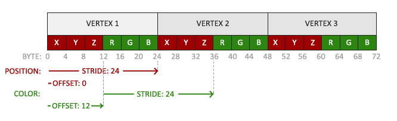

### Primitives

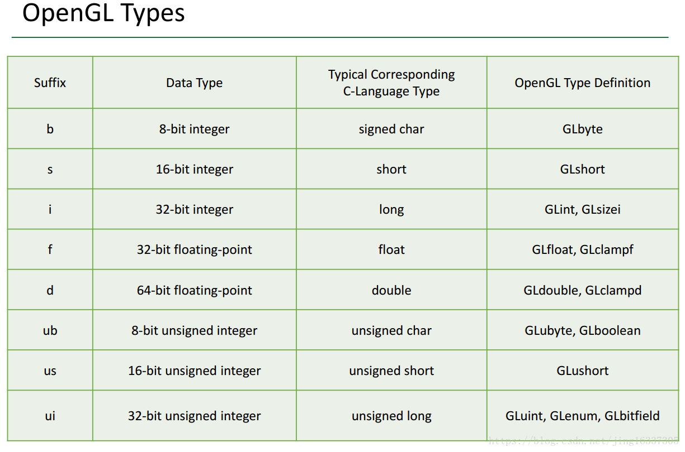

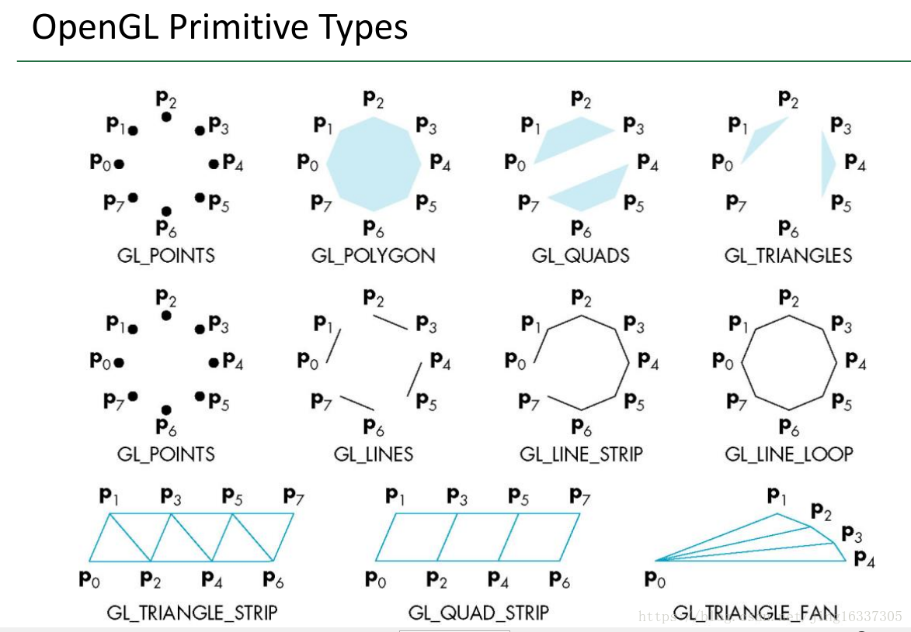

### VBO

Can store a large number of vertices in the GPU's memory.

```glsl
// 2. copy our vertices array in a buffer for OpenGL to use
float vertices[] = {....} // the vertices we want to store in VBO
glBindBuffer(GL_ARRAY_BUFFER, VBO);
glBufferData(GL_ARRAY_BUFFER, sizeof(vertices), vertices, GL_STATIC_DRAW);
```

### VAO

1. VAO encapsulates information about the format of vertex data and the associated Buffer Objects (VBOs)
2. VAO makes switching between different vertex data and attribute configurations as easy as binding a different VAO. All the state we just set is stored inside the VAO.

```glsl
// 1. bind Vertex Array Object
glBindVertexArray(VAO);

// 3. then set our vertex attributes pointers
glVertexAttribPointer(0, 3, GL_FLOAT, GL_FALSE, 6 * sizeof(float), (void*)0);
glEnableVertexAttribArray(0);

// color attribute
glVertexAttribPointer(1, 3, GL_FLOAT, GL_FALSE, 6 * sizeof(float), (void*)(3* sizeof(float)));
glEnableVertexAttribArray(1);

/*
void glVertexAttribPointer(GLuint index, // the index in one element that will be sent in the vertex
 	GLint size, // the size of the attribute
 	GLenum type, 
 	GLboolean normalized,
 	GLsizei stride, // the size to move to the next attribute
 	const void * pointer); // the offset of the attribute (look above to check what obset represent)
*/
```

### EBO

 EBO is a buffer, just like a vertex buffer object, that stores indices that OpenGL uses to decide what vertices to draw.

```glsl
float vertices[] = {
    // first triangle
     0.5f,  0.5f, 0.0f,  // top right
     0.5f, -0.5f, 0.0f,  // bottom right
    -0.5f,  0.5f, 0.0f,  // top left 
    // second triangle
     0.5f, -0.5f, 0.0f,  // bottom right
    -0.5f, -0.5f, 0.0f,  // bottom left
    -0.5f,  0.5f, 0.0f   // top left
};

unsigned int indices[] = {  // note that we start from 0!
    0, 1, 3,   // first triangle
    1, 2, 3    // second triangle
};

// similar to VBO
unsigned int EBO;
glGenBuffers(1, &EBO);
glBindBuffer(GL_ELEMENT_ARRAY_BUFFER, EBO);
glBufferData(GL_ELEMENT_ARRAY_BUFFER, sizeof(indices), indices, GL_STATIC_DRAW);
```

### Uniform

1. uniforms are global. Global, meaning that a uniform variable is unique per shader program object, and can be accessed from any shader at any stage in the shader program. 
2.  whatever you set the uniform value to, uniforms will keep their values until they're either reset or updated.

```glsl
int uniformlocation = glGetUniformLocation(shaderProgram, "ourColor");
float value = ...
glUseProgram(shaderProgram);
// require to use the program before glniform
glUniform4f(uniformlocation , 0.0f, value, 0.0f, 1.0f);

// shader
// The name have to be the same
uniform float ourColor
```

### Transformation
[MVP Knowledge Base](./mvp.md)
```glsl
// Translation
glm::vec4 vec(1.0f, 0.0f, 0.0f, 1.0f);
glm::mat4 trans = glm::mat4(1.0f); // identity transformation matrix
trans = glm::translate(trans, glm::vec3(1.0f, 1.0f, 0.0f)); // translate trans by the second arg
vec = trans * vec;

// Rotate
glm::mat4 trans = glm::mat4(1.0f);
trans = glm::rotate(trans, glm::radians(90.0f), glm::vec3(0.0, 0.0, 1.0)); // (target, angle, axis) 
trans = glm::scale(trans, glm::vec3(0.5, 0.5, 0.5));
```

## Texture

### Texture Wrapping

Texture Wrapping refers to how textures are handled when their coordinates extend beyond the standard range of (0,0) to (1,1). Below are some options:

- GL_REPEAT: The default behavior for textures. Repeats the texture image.
- GL_MIRRORED_REPEAT: Same as  but mirrors the image with each repeat.
    
    GL_REPEAT
    
- GL_CLAMP_TO_EDGE: Clamps the coordinates between 0 and 1. The result is that higher coordinates become clamped to the edge, resulting in a stretched edge pattern.
- GL_CLAMP_TO_BORDER: Coordinates outside the range are now given a user-specified border color.


### Texture Filtering

When mapping a texture to an object, we need to determine which texel (texture pixel) corresponds to each fragment (pixel) on the object’s surface. OpenGL offers some options:

- GL_NEAREST: Nearest-neighbor sampling
- GL_LINEAR: Linear filtering

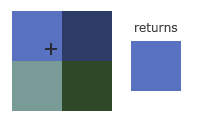

### Mipmaps

Create many textures of decreasing size and use one of these sub textures when appropriate. Imagine we had a large room with thousands of objects, each with an attached texture. There will be objects far away that have the same high-resolution texture attached as the objects close to the viewer. Since the objects are far away and probably only produce a few fragments, OpenGL has difficulties retrieving the right color value for its fragment from the high-resolution texture, since it has to pick a texture color for a fragment that spans a large part of the texture. There are some options in OpenGL when approximate a mipmap for a specific resolution.

- GL_NEAREST_MIPMAP_NEAREST: takes the nearest mipmap to match the pixel size and uses nearest neighbor interpolation for texture sampling.
- GL_LINEAR_MIPMAP_NEAREST: takes the nearest mipmap level and samples that level using linear interpolation.
- GL_NEAREST_MIPMAP_LINEAR: linearly interpolates between the two mipmaps that most closely match the size of a pixel and samples the interpolated level via nearest neighbor interpolation.
- GL_LINEAR_MIPMAP_LINEAR: linearly interpolates between the two closest mipmaps and samples the interpolated level via linear interpolation.

```glsl
// Texture Wrapping
glTexParameteri(GL_TEXTURE_2D, GL_TEXTURE_WRAP_S, GL_MIRRORED_REPEAT);
glTexParameteri(GL_TEXTURE_2D, GL_TEXTURE_WRAP_T, GL_MIRRORED_REPEAT);
// Texture Filtering
glTexParameteri(GL_TEXTURE_2D, GL_TEXTURE_MIN_FILTER, GL_NEAREST);
glTexParameteri(GL_TEXTURE_2D, GL_TEXTURE_MAG_FILTER, GL_LINEAR);
// Mipmaps
glTexParameteri(GL_TEXTURE_2D, GL_TEXTURE_MIN_FILTER, GL_LINEAR_MIPMAP_LINEAR);
glTexParameteri(GL_TEXTURE_2D, GL_TEXTURE_MAG_FILTER, GL_LINEAR);
```

### Texture swizzling

Texture objects can have swizzling parameters. This only works for textures with color image formats. Each of the four output components, RGBA, can be set to come from a particular color channel.

- GL_RED: The value for this component comes from the red channel of the image. All color formats have at least a red channel.
- GL_GREEN: The value for this component comes from the green channel of the image, or 0 if it has no green channel.
- GL_BLUE: The value for this component comes from the blue channel of the image, or 0 if it has no blue channel.
- GL_ALPHA: The value for this component comes from the alpha channel of the image, or 1 if it has no alpha channel.
- GL_ZERO: The value for this component is always 0.
- GL_ONE: The value for this component is always 1.

### Generate texture from an image

```glsl
int width, height, nrChannels;
unsigned char *image_data = stbi_load("container.jpg", &width, &height, &nrChannels, 0);

// generate id and bind
unsigned int texture;
glGenTextures(1, &texture);
glBindTexture(GL_TEXTURE_2D, texture);

glTexImage2D(GL_TEXTURE_2D, 0, GL_RGB, width, height, 0, GL_RGB, GL_UNSIGNED_BYTE, image_data);
// The function that loads texture into GPU memory
// glTexImage2D(texture_target, mip map level, kind of texture, width, height, 0, format of source image, format of source image, image_data)
glGenerateMipmap(GL_TEXTURE_2D);

// Set uniform in fragment shader
GLuint textureLocation = glGetUniformLocation(shaderProgram, "textureSampler");
glUniform1i(textureLocation, 0); // 0 is the texture unit index
```

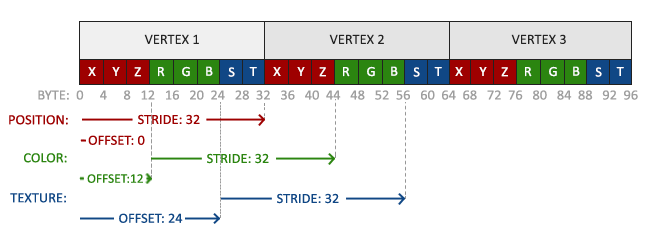

```glsl
// Texture coordinates can store in VBO with VAO as well. 
glVertexAttribPointer(2, 2, GL_FLOAT, GL_FALSE, 8 * sizeof(float), (void*)(6 * sizeof(float)));
glEnableVertexAttribArray(2);

// Fragement Shader
#version 330 core
out vec4 FragColor;
in vec3 ourColor;
in vec2 TexCoord;

// texture sampler
// the name require to be the same in glGetUniformLocation
uniform sampler2D textureSampler;

void main()
{
	FragColor = texture(texture1, TexCoord);
}
```

### Bump and normal mapping

To represent surface details and avoid heavy geomertric computation.

Calculate reflection with a normal map or a height map (bump mapping)

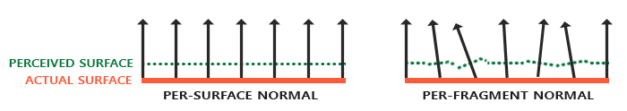

## Lighting

### Phong Lighting Model

Diffuse + Ambient + Reflection 

```glsl
glm::vec3 lightPos(1.2f, 1.0f, 2.0f);

// Fragment Shader

// fragment shader works in screen space, so we need to transfer Normal and FragPos from vertex shader
in vec3 Normal;  
in vec3 FragPos;

// ambient
float ambientStrength = 0.1;
vec3 ambient = ambientStrength * lightColor;

// diffuse 
vec3 norm = normalize(Normal);
vec3 lightDir = normalize(lightPos - FragPos);
float diff = max(dot(norm, lightDir), 0.0);
vec3 diffuse = diff * lightColor;

// specular
float specularStrength = 0.5;
vec3 viewDir = normalize(viewPos - FragPos);
vec3 reflectDir = reflect(-lightDir, norm);  
float spec = pow(max(dot(viewDir, reflectDir), 0.0), 32);
vec3 specular = specularStrength * spec * lightColor;  
  
vec3 result = (ambient + diffuse + specular) * objectColor;
FragColor = vec4(result, 1.0);
```

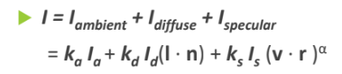

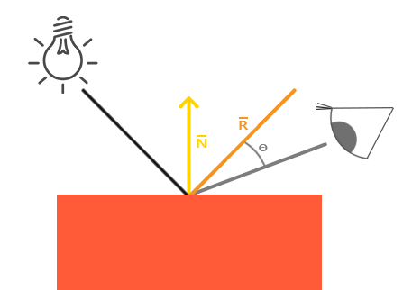

### Gouraud shading

Interpolates colors across polygons based on vertex colors (applying Phong lighting at the vertices). It is less computationally expensive.

### Phong shading

Interpolates normal vectors across the surface of the polygon from the vertex normals and then applies Phong lighting. It results in smoother shading but is more computationally expensive.

### Blinn-Phong Shading:

An extension of the Phong lighting model that uses a halfway vector instead of a reflection vector to calculate specular reflections, overcoming some of the limitations of Phong shading.

- replace v, r with n and h
- **[Halfway Vector**: A unit vector that is exactly halfway between the light direction and the view direction1](https://edgeservices.bing.com/edgesvc/chat?udsframed=1&form=SHORUN&clientscopes=chat,noheader,udsedgeshop,channelstable,ntpquery,devtoolsapi,udsinwin11,udsdlpconsent,udsarefresh,cspgrd,&shellsig=3c5e6a8f69df2d6d8f635efef0ace0d9e0c6d6dc&setlang=en-US&darkschemeovr=1#sjevt%7CDiscover.Chat.SydneyClickPageCitation%7Cadpclick%7C0%7C6d91d882-0e00-45f4-9f99-8c0f9080d6a3%7C%7B%22sourceAttributions%22%3A%7B%22providerDisplayName%22%3A%22Instead%20of...%22%2C%22pageType%22%3A%22html%22%2C%22pageIndex%22%3A1%2C%22relatedPageUrl%22%3A%22https%253A%252F%252Flearnopengl.com%252FAdvanced-Lighting%252FAdvanced-Lighting%22%2C%22lineIndex%22%3A6%2C%22highlightText%22%3A%22Instead%20of%20relying%20on%20a%20reflection%20vector%20we're%20using%20a%20so%20called%20halfway%20vector%20that%20is%20a%20unit%20vector%20exactly%20halfway%20between%20the%20view%20direction%20and%20the%20light%20direction.%22%2C%22snippets%22%3A%5B%5D%7D%7D)[2](https://edgeservices.bing.com/edgesvc/chat?udsframed=1&form=SHORUN&clientscopes=chat,noheader,udsedgeshop,channelstable,ntpquery,devtoolsapi,udsinwin11,udsdlpconsent,udsarefresh,cspgrd,&shellsig=3c5e6a8f69df2d6d8f635efef0ace0d9e0c6d6dc&setlang=en-US&darkschemeovr=1#sjevt%7CDiscover.Chat.SydneyClickPageCitation%7Cadpclick%7C1%7C6d91d882-0e00-45f4-9f99-8c0f9080d6a3%7C%7B%22sourceAttributions%22%3A%7B%22providerDisplayName%22%3A%22%5C%22Instead%20o...%22%2C%22pageType%22%3A%22html%22%2C%22pageIndex%22%3A1%2C%22relatedPageUrl%22%3A%22https%253A%252F%252Flearnopengl.com%252FAdvanced-Lighting%252FAdvanced-Lighting%22%2C%22lineIndex%22%3A37%2C%22highlightText%22%3A%22%5C%22Instead%20of%20relying%20on%20a%20reflection%20vector%20we're%20using%20a%20so%20called%20halfway%20vector%20that%20is%20a%20unit%20vector%20exactly%20halfway%20between%20the%20surface%20normal%20and%20the%20light's%20direction%20vector.%20%5C%22%20-%3E%20I%20think%20you%20meant%20exactly%20between%20the%20light%20vector%20and%20the%20view%20vector.%22%2C%22snippets%22%3A%5B%5D%7D%7D). [The closer this vector aligns with the surface normal, the higher the specular contribution3](https://edgeservices.bing.com/edgesvc/chat?udsframed=1&form=SHORUN&clientscopes=chat,noheader,udsedgeshop,channelstable,ntpquery,devtoolsapi,udsinwin11,udsdlpconsent,udsarefresh,cspgrd,&shellsig=3c5e6a8f69df2d6d8f635efef0ace0d9e0c6d6dc&setlang=en-US&darkschemeovr=1#sjevt%7CDiscover.Chat.SydneyClickPageCitation%7Cadpclick%7C2%7C6d91d882-0e00-45f4-9f99-8c0f9080d6a3%7C%7B%22sourceAttributions%22%3A%7B%22providerDisplayName%22%3A%22The%20closer...%22%2C%22pageType%22%3A%22html%22%2C%22pageIndex%22%3A1%2C%22relatedPageUrl%22%3A%22https%253A%252F%252Flearnopengl.com%252FAdvanced-Lighting%252FAdvanced-Lighting%22%2C%22lineIndex%22%3A6%2C%22highlightText%22%3A%22The%20closer%20this%20halfway%20vector%20aligns%20with%20the%20surface's%20normal%20vector%2C%20the%20higher%20the%20specular%20contribution.%22%2C%22snippets%22%3A%5B%5D%7D%7D).
- Comparison with Phong Shading: Blinn-Phong shading produces more realistic results, especially with low shininess values, and avoids the specular cutoff issue of Phong shading. [However, it requires a higher shininess exponent to achieve similar effects as Phong shading4](https://edgeservices.bing.com/edgesvc/chat?udsframed=1&form=SHORUN&clientscopes=chat,noheader,udsedgeshop,channelstable,ntpquery,devtoolsapi,udsinwin11,udsdlpconsent,udsarefresh,cspgrd,&shellsig=3c5e6a8f69df2d6d8f635efef0ace0d9e0c6d6dc&setlang=en-US&darkschemeovr=1#sjevt%7CDiscover.Chat.SydneyClickPageCitation%7Cadpclick%7C3%7C6d91d882-0e00-45f4-9f99-8c0f9080d6a3%7C%7B%22sourceAttributions%22%3A%7B%22providerDisplayName%22%3A%22As%20a%20resul...%22%2C%22pageType%22%3A%22html%22%2C%22pageIndex%22%3A1%2C%22relatedPageUrl%22%3A%22https%253A%252F%252Flearnopengl.com%252FAdvanced-Lighting%252FAdvanced-Lighting%22%2C%22lineIndex%22%3A15%2C%22highlightText%22%3A%22As%20a%20result%2C%20to%20get%20visuals%20similar%20to%20Phong%20shading%20the%20specular%20shininess%20exponent%20has%20to%20be%20set%20a%20bit%20higher.%22%2C%22snippets%22%3A%5B%5D%7D%7D).
- Improve efficiency (in phong model, it requires the calculation of a new reflection vector and view vector for each vertex)

### Forward Ray Tracing

Rays emanate from light sources and bounce around in the scene.

Rays that pass through the projetion plane and contribute to the final image

Really slow and inefficient

### Backward Ray tracing

For each pixel, trace the eye ray (primary ray) to the first visible surface and for each intersection trace secondary rays:

1. Shadow rays: in directions L to light source
2. Reflected ray
3. Refracted (transmitted ray)

### Gamma correction

Human perception of brightness (lightness) follows an approximate power function, with greater sensitivity to relative differences between darker tones than between lighter tones.

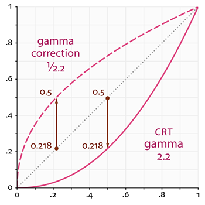

### HDR

- **[HDR Rendering**: A technique that allows for a higher range of color values than the default [0.0, 1.0] range, preserving more details in dark and bright areas of a scene1](https://edgeservices.bing.com/edgesvc/chat?udsframed=1&form=SHORUN&clientscopes=chat,noheader,udsedgeshop,channelstable,ntpquery,devtoolsapi,udsinwin11,udsdlpconsent,udsarefresh,cspgrd,&shellsig=3c5e6a8f69df2d6d8f635efef0ace0d9e0c6d6dc&setlang=en-US&darkschemeovr=1#sjevt%7CDiscover.Chat.SydneyClickPageCitation%7Cadpclick%7C0%7C08d3e121-4e99-4152-a9bb-1717d62d8864%7C%7B%22sourceAttributions%22%3A%7B%22providerDisplayName%22%3A%22We%20allow%20f...%22%2C%22pageType%22%3A%22html%22%2C%22pageIndex%22%3A1%2C%22relatedPageUrl%22%3A%22https%253A%252F%252Flearnopengl.com%252FAdvanced-Lighting%252FHDR%22%2C%22lineIndex%22%3A7%2C%22highlightText%22%3A%22We%20allow%20for%20a%20much%20larger%20range%20of%20color%20values%20to%20render%20to%2C%20collecting%20a%20large%20range%20of%20dark%20and%20bright%20details%20of%20a%20scene%2C%20and%20at%20the%20end%20we%20transform%20all%20the%20HDR%20values%20back%20to%20the%20low%20dynamic%20range%20(LDR)%20of%20%5B%200.0%2C%201.0%20%5D.%22%2C%22snippets%22%3A%5B%5D%7D%7D).
- Floating Point Framebuffers: Framebuffers that can store floating point values outside the default range, preventing color values from getting clamped after each fragment shader run.

When the internal format of a framebuffer's color buffer is specified as GL_RGB16F, GL_RGBA16F, GL_RGB32F, or GL_RGBA32F the framebuffer is known as a floating-point framebuffer that can store floating point values outside the default range of 0~1. This is perfect for rendering in high dynamic range!

## Advanced

### Z-buffer & Depth Testing & Z-fighting

1. OpenGL stores all its depth information in a Z-buffer(float), also known as a depth buffer.
2. The depth is stored within each fragment (as the fragment's x value) and whenever the fragment wants to output its color, OpenGL compares its depth values with the Z-buffer.
3. Depth testing is automatically enabled.
4. Some options that allow customize
5. **Z-fighting**: A common visual artifact may occur when two planes or triangles are so closely aligned to each other that the depth buffer does not have enough precision to figure out which one of the two shapes is in front of the other.
    1. **Prevent z-fighting: Creating a small offset between two objects you can completely remove z-fighting between the two objects.**
    2. Set the near plane as far as possible since precision is extremely large when close to the near plane.
    3. *higher precision depth buffer*

| GL_ALWAYS | The depth test always passes. |
| --- | --- |
| GL_NEVER | The depth test never passes. |
| GL_LESS | Passes if the fragment's depth value is less than the stored depth value. |
| GL_EQUAL | Passes if the fragment's depth value is equal to the stored depth value. |
| GL_LEQUAL | Passes if the fragment's depth value is less than or equal to the stored depth value. |
| GL_GREATER | Passes if the fragment's depth value is greater than the stored depth value. |
| GL_NOTEQUAL | Passes if the fragment's depth value is not equal to the stored depth value. |
| GL_GEQUAL | Passes if the fragment's depth value is greater than or equal to the stored depth value. |

```glsl
glEnable(GL_DEPTH_TEST);
glDepthFunc(GL_LESS);
// If you have depth testing enabled you should also clear the depth buffer before each frame using GL_DEPTH_BUFFER_BIT; otherwise you're stuck with the depth values from last frame:
glClear(GL_COLOR_BUFFER_BIT | GL_DEPTH_BUFFER_BIT);
```

One important thing to remember is that the values in the depth buffer are not linear in clip-space (they are linear in view-space before the projection matrix is applied). A value of 0.5 in the depth buffer does not mean the pixel's z-value is halfway in the frustum; the z-value of the vertex is actually quite close to the near plane! (Better separate front elements)

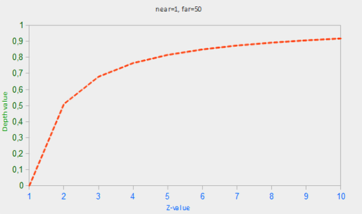

### Stencil Buffer

1. 1 byte = 8 bit integer
2. Masking
3. Use cases: mirrors, outlining objects. 
    1. First, render the object normally, updating the stencil buffer where the object’s fragments are rendered (usually with a value of 1).
    2. Next, render the object again, but this time scale it up slightly (using a different shader) and update the stencil buffer with a different value

```glsl
glEnable(GL_STENCIL_TEST);
glClear(GL_COLOR_BUFFER_BIT | GL_DEPTH_BUFFER_BIT | GL_STENCIL_BUFFER_BIT);

glStencilMask(0xFF); // each bit is written to the stencil buffer as is (can modify anything)
glStencilMask(0x00); // each bit ends up as 0 in the stencil buffer (cannot modify anything)

glStencilFunc(GL_EQUAL, 1, 0xFF)
// control how to pass/ fail test

glStencilOp(GLenum sfail, GLenum dpfail, GLenum dppass)
/*
sfail: action to take if the stencil test fails.
dpfail: action to take if the stencil test passes, but the depth test fails.
dppass: action to take if both the stencil and the depth test pass.

Actions
GL_KEEP	The currently stored stencil value is kept.
GL_ZERO	The stencil value is set to 0.
GL_REPLACE	The stencil value is replaced with the reference value set with glStencilFunc.
GL_INCR	The stencil value is increased by 1 if it is lower than the maximum value.
GL_INCR_WRAP	Same as GL_INCR, but wraps it back to 0 as soon as the maximum value is exceeded.
GL_DECR	The stencil value is decreased by 1 if it is higher than the minimum value.
GL_DECR_WRAP	Same as GL_DECR, but wraps it to the maximum value if it ends up lower than 0.
GL_INVERT	Bitwise inverts the current stencil buffer value.
*/
// control result of passing failing a test

glEnable(GL_STENCIL_TEST);
glClear(GL_COLOR_BUFFER_BIT | GL_DEPTH_BUFFER_BIT | GL_STENCIL_BUFFER_BIT);
```

### Face culling

Use winding order to check if the object is facing front face or back face. 

Use case: not rendering model inside (cannot see mode’s inside) 

```glsl
glEnable(GL_CULL_FACE);
glCullFace(GL_FRONT);
glFrontFace(GL_CCW); // counter clockwise
```

### Transparency & Blending

### Discard Fragment

Some effects do not care about partial transparency, but either want to show something or nothing at all based on the color value of a texture. (grass)

```glsl
#version 330 core
out vec4 FragColor;

in vec2 TexCoords;

uniform sampler2D texture1;

void main()
{             
    vec4 texColor = texture(texture1, TexCoords);
    if(texColor.a < 0.1)
        discard;
    FragColor = texColor;
}
```

### Blending

All about objects (or parts of them) not having a solid color but having a combination of colors from the object itself and any other object behind it with varying intensity. = blend several pixel colors (from different objects) to a single color

The formula used is  C¯result=C¯source∗Fsource+C¯destination∗Fdestination

To make blending work for multiple objects we have to draw the most distant object first and the closest object last.

1. Draw all opaque objects first.
2. Sort all the transparent objects.
3. Draw all the transparent objects in sorted order.

```glsl
glEnable(GL_BLEND);

glBlendFunc(GL_SRC_ALPHA, GL_ONE_MINUS_SRC_ALPHA);

glBlendFuncSeparate(GL_SRC_ALPHA, GL_ONE_MINUS_SRC_ALPHA, GL_ONE, GL_ZERO);
// set R, G, B, Aplpha independently

glBlendFuncSeparate(GL_SRC_ALPHA, GL_ONE_MINUS_SRC_ALPHA, GL_ONE, GL_ZERO) // controls how to blend
/*
GL_FUNC_ADD: the default, adds both colors to each other: C¯result=Src+Dst
GL_FUNC_SUBTRACT: subtracts both colors from each other: C¯result=Src−Dst
GL_FUNC_REVERSE_SUBTRACT: subtracts both colors, but reverses order: C¯result=Dst−Src
GL_MIN: takes the component-wise minimum of both colors: C¯result=min(Dst,Src)
GL_MAX: takes the component-wise maximum of both colors: C¯result=max(Dst,Src)
*/
```


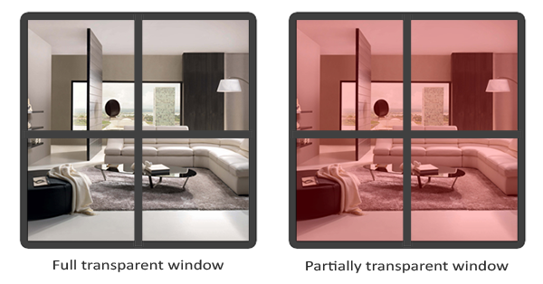

### Frame buffer

Frame buffer = the combination of color, depth, stencil buffer is stored somewhere in GPU memory and is called a framebuffer

OpenGL has a default frame buffer; however, OpenGL allow users to create their own frame buffer for off-screen rendering (or post-processing). 

可以將 custom frame buffer 想像成 stores pointer that points to color, depth, stencil buffers. (not an actual buffer)

```c
// Just like a normal buffer
unsigned int fbo;
glGenFramebuffers(1, &fbo);
glBindFramebuffer(GL_FRAMEBUFFER, fbo);

// Activate the default frame buffer
glBindFramebuffer(GL_FRAMEBUFFER, 0);

// Attach texture to custom frame buffer
unsigned int texture;
glGenTextures(1, &texture);
glBindTexture(GL_TEXTURE_2D, texture);

// the width and height is the whole screen (800 * 600) 
// the last argument is NULL, since we only allocating the space instead of transfering the data
glTexImage2D(GL_TEXTURE_2D, 0, GL_RGB, 800, 600, 0, GL_RGB, GL_UNSIGNED_BYTE, NULL);

glTexParameteri(GL_TEXTURE_2D, GL_TEXTURE_MIN_FILTER, GL_LINEAR);
glTexParameteri(GL_TEXTURE_2D, GL_TEXTURE_MAG_FILTER, GL_LINEAR);

// Arrach texture to the buffer
/*
target: the framebuffer type we're targeting (draw, read or both).
attachment: the type of attachment we're going to attach. Right now we're attaching a color attachment. Note that the 0 at the end suggests we can attach more than 1 color attachment. We'll get to that in a later chapter.
textarget: the type of the texture you want to attach.
texture: the actual texture to attach.
level: the mipmap level. We keep this at 0.
*/
glFramebufferTexture2D(GL_FRAMEBUFFER, GL_COLOR_ATTACHMENT0, GL_TEXTURE_2D, texture, 0);
```

### Render buffer

Just like a texture image, a renderbuffer object is an actual buffer.

A renderbuffer object cannot be directly read from. This gives it the added advantage that OpenGL can do a few memory optimizations that can give it a performance edge over textures for off-screen rendering to a framebuffer. (fast for write)

Render buffer cannot be access (read) from shader.

```c
unsigned int rbo;
glGenRenderbuffers(1, &rbo);
glBindRenderbuffer(GL_RENDERBUFFER, rbo);

glRenderbufferStorage(GL_RENDERBUFFER, GL_DEPTH24_STENCIL8, 800, 600);
// Attach render buffer with frame buffer
glFramebufferRenderbuffer(GL_FRAMEBUFFER, GL_DEPTH_STENCIL_ATTACHMENT, GL_RENDERBUFFER, rbo);
```

In the main code

```c
// first pass
glBindFramebuffer(GL_FRAMEBUFFER, framebuffer);
glClearColor(0.1f, 0.1f, 0.1f, 1.0f);
glClear(GL_COLOR_BUFFER_BIT | GL_DEPTH_BUFFER_BIT); // we're not using the stencil buffer now
glEnable(GL_DEPTH_TEST);
DrawScene();	// will draw on the frame buffer
  
// second pass
glBindFramebuffer(GL_FRAMEBUFFER, 0); // back to default
glClearColor(1.0f, 1.0f, 1.0f, 1.0f); 
glClear(GL_COLOR_BUFFER_BIT);
  
screenShader.use();  
glBindVertexArray(quadVAO); // quad is the screen quad (the whole screen)
// remember to close the depth to avoid the box disappear
glDisable(GL_DEPTH_TEST);
glBindTexture(GL_TEXTURE_2D, textureColorbuffer);
glDrawArrays(GL_TRIANGLES, 0, 6);
```

### Cube box

A 3d box texture that contains 6 individual texture

```glsl
int width, height, nrChannels;
unsigned char *data;  
for(unsigned int i = 0; i < textures_faces.size(); i++)
{
    data = stbi_load(textures_faces[i].c_str(), &width, &height, &nrChannels, 0);
    glTexImage2D(
        GL_TEXTURE_CUBE_MAP_POSITIVE_X + i, 
        0, GL_RGB, width, height, 0, GL_RGB, GL_UNSIGNED_BYTE, data
    );
}

in vec3 textureDir; // direction vector representing a 3D texture coordinate
uniform samplerCube cubemap; // cubemap texture sampler

void main()
{             
    FragColor = texture(cubemap, textureDir);
}
```

### Instances

There is a scene where you're drawing a lot of models where most of these models contain the same set of vertex data, but with different world transformations. There are two ways to achieve

1. use an array of matrices as uniform variable.
    1. If there are too many items, the uniform array buffer may be not enough.

```c
glm::vec2 translations[100];
int index = 0;
float offset = 0.1f;
for(int y = -10; y < 10; y += 2)
{
    for(int x = -10; x < 10; x += 2)
    {
        glm::vec2 translation;
        translation.x = (float)x / 10.0f + offset;
        translation.y = (float)y / 10.0f + offset;
        translations[index++] = translation;
    }
}
// setting 100 uniform vec
shader.use();
for(unsigned int i = 0; i < 100; i++)
{
    shader.setVec2(("offsets[" + std::to_string(i) + "]")), translations[i]);
}

glBindVertexArray(quadVAO);
// use glDrawArraysInstanced or glDrawElementsInstanced instead of glDrawArrays and glDrawElement
// The last parameter that sets the number of instances we want to draw
glDrawArraysInstanced(GL_TRIANGLES, 0, 6, 100);

// vertex shader
#version 330 core
layout (location = 0) in vec2 aPos;
layout (location = 1) in vec3 aColor;

out vec3 fColor;

uniform vec2 offsets[100];

void main()
{
    vec2 offset = offsets[gl_InstanceID];
    gl_Position = vec4(aPos + offset, 0.0, 1.0);
    fColor = aColor;
}
```

1. Use VAO and VBO (Instance arrays)

```c
unsigned int instanceVBO;
glGenBuffers(1, &instanceVBO);
glBindBuffer(GL_ARRAY_BUFFER, instanceVBO);
glBufferData(GL_ARRAY_BUFFER, sizeof(glm::vec2) * 100, &translations[0], GL_STATIC_DRAW);
glBindBuffer(GL_ARRAY_BUFFER, 0);

glEnableVertexAttribArray(2);
glBindBuffer(GL_ARRAY_BUFFER, instanceVBO);
glVertexAttribPointer(2, 2, GL_FLOAT, GL_FALSE, 2 * sizeof(float), (void*)0);
glBindBuffer(GL_ARRAY_BUFFER, 0);	
// VertexAttriDivisor
// By default, the attribute divisor is 0 which tells OpenGL to update the content of the vertex attribute each iteration of the vertex shader
// By setting this attribute to 1 we're telling OpenGL that we want to update the content of the vertex attribute when we start to render a new instance.
// By setting it to 2 we'd update the content every 2 instances and so on.
glVertexAttribDivisor(2, 1);
```

### Anti Aliasing

Multisampling: one sample each fragment to multi samples each fragment.

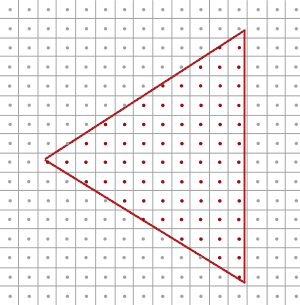

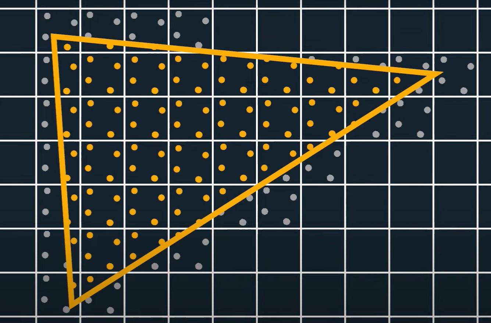

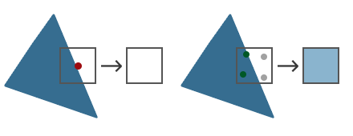

1. Use without frame buffer

```c
glfwWindowHint(GLFW_SAMPLES, number_of_sampels);
// create a rendering window, but this time with a buffer containing 4 subsamples per screen coordinate
glEnable(GL_MULTISAMPLE);
```

1. Use our own frame buffer

```c
// To create a texture that supports storage of multiple sample points
// we use glTexImage2DMultisample
glBindTexture(GL_TEXTURE_2D_MULTISAMPLE, tex);
glTexImage2DMultisample(GL_TEXTURE_2D_MULTISAMPLE, samples, GL_RGB, width, height, GL_TRUE);
glBindTexture(GL_TEXTURE_2D_MULTISAMPLE, 0);

// To attach a multisampled texture to a framebuffer we use glFramebufferTexture2D
// But this time with GL_TEXTURE_2D_MULTISAMPLE as the texture type:
glFramebufferTexture2D(GL_FRAMEBUFFER, GL_COLOR_ATTACHMENT0, GL_TEXTURE_2D_MULTISAMPLE, tex, 0);

// creating a multisampled renderbuffer
glRenderbufferStorageMultisample(GL_RENDERBUFFER, 4, GL_DEPTH24_STENCIL8, width, height);
```

## Debug

```c
GLenum glGetError();

glBindTexture(GL_TEXTURE_2D, tex);
std::cout << glGetError() << std::endl; // returns 0 (no error)

GLenum glCheckError_(const char *file, int line)
{
    GLenum errorCode;
    while ((errorCode = glGetError()) != GL_NO_ERROR)
    {
        std::string error;
        switch (errorCode)
        {
            case GL_INVALID_ENUM:                  error = "INVALID_ENUM"; break;
            case GL_INVALID_VALUE:                 error = "INVALID_VALUE"; break;
            case GL_INVALID_OPERATION:             error = "INVALID_OPERATION"; break;
            case GL_STACK_OVERFLOW:                error = "STACK_OVERFLOW"; break;
            case GL_STACK_UNDERFLOW:               error = "STACK_UNDERFLOW"; break;
            case GL_OUT_OF_MEMORY:                 error = "OUT_OF_MEMORY"; break;
            case GL_INVALID_FRAMEBUFFER_OPERATION: error = "INVALID_FRAMEBUFFER_OPERATION"; break;
        }
        std::cout << error << " | " << file << " (" << line << ")" << std::endl;
    }
    return errorCode;
}
```

### Debug output in GLFW

```c
glfwWindowHint(GLFW_OPENGL_DEBUG_CONTEXT, true);
```

## Shader Debug

One frequently used trick to figure out what is wrong with a shader is to evaluate all the relevant variables in a shader program by sending them directly to the fragment shader's output channel.

For example, to check if norm is correct

```c
#version 330 core
out vec4 FragColor;
in vec3 Normal;
[...]
  
void main()
{
    [...]
		// output in fragment shader
    FragColor.rgb = Normal;
    FragColor.a = 1.0f;
}
```